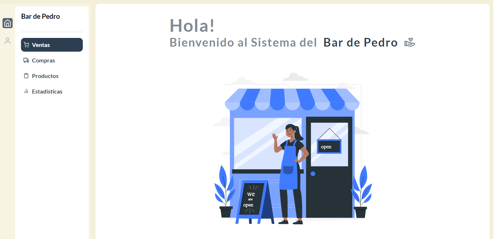

## Sistema para el Bar de Pedro - Grupo C

### Guia de instalación

- Descargar repositorio completo
- Abrir con un editor de codigos fuente (De preferencia Visual Studio Code)
- Ejecutar los siguiente comandos:
    - npm i
    - npm i sass
    - npm run dev
- Colocar la direccion que brinda la consola en un navegador web.

### Built with

- Semantic HTML5 markup
- CSS custom properties
- React
- Javascripts
